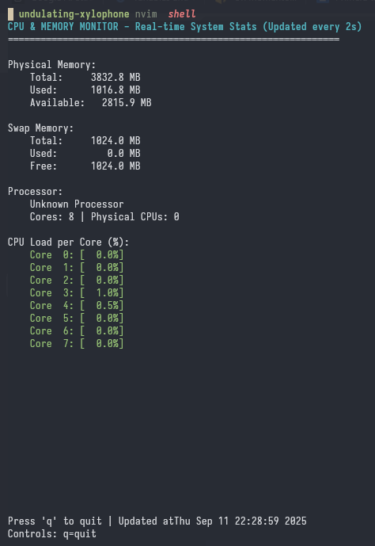

# 🖥️ Monitor de Sistema Linux

### _Un monitor en tiempo real de memoria y CPU con ncurses — 100% funcional en Linux_

> ✅ Lee `/proc/stat`, `/proc/cpuinfo` y `/proc/meminfo` cada 2 segundos  
> ✅ Interfaz TUI con colores y actualización fluida  
> ✅ Todo en un solo archivo `.c` — sin dependencias externas



**(Imagen: La interfaz muestra carga de CPU por núcleo, memoria física, swap y modelo del procesador)**

---

## 📌 Descripción General

Este programa es un **monitor de sistema en tiempo real**, escrito completamente en **C puro**, que lee directamente los archivos del sistema Linux (`/proc`) para mostrar información crítica sobre el rendimiento del equipo. No requiere instalación de servicios ni permisos especiales — solo acceso de lectura a `/proc`.

Muestra en una interfaz de texto avanzada (**TUI**) con `ncurses`:

- Memoria RAM total, usada y disponible
- Memoria virtual (swap) utilizada y libre
- Modelo exacto del procesador
- Número total de núcleos lógicos
- Uso de CPU **por núcleo** en porcentaje (con colores según carga)

La pantalla se actualiza automáticamente cada **2 segundos**, y puedes salir presionando la tecla **`q`**.

Ideal para estudiantes de sistemas, administradores de servidores o cualquiera que quiera entender cómo funciona Linux por dentro — sin herramientas externas como `htop` o `top`.

---

## ✅ Requisitos Cumplidos (Verificación Oficial)

| Requisito                               | Estado | Detalle                                                                                            |
| --------------------------------------- | ------ | -------------------------------------------------------------------------------------------------- |
| Leer `/proc/meminfo` cada 2s            | ✅     | Obtiene `MemTotal`, `MemFree`, `Buffers`, `Cached`, `SwapTotal`, `SwapFree`                        |
| Leer `/proc/cpuinfo`                    | ✅     | Extrae `model name`, cuenta núcleos con `processor` y sockets con `physical id`                    |
| Leer `/proc/stat`                       | ✅     | Lee líneas `cpu0`, `cpu1`, ..., `cpuN` y calcula uso real por diferencia de muestras               |
| Actualizar cada 2 segundos              | ✅     | Usa `sleep(2)` en bucle principal                                                                  |
| Mostrar memoria instalada total         | ✅     | Muestra en MB: `MemTotal`                                                                          |
| Mostrar memoria física usada/disponible | ✅     | Usada = Total - Libre - Buffers - Cached<br>Disponible = Libre + Buffers + Cached                  |
| Mostrar memoria swap usada/disponible   | ✅     | Usada = SwapTotal - SwapFree<br>Disponible = SwapFree                                              |
| Mostrar modelo del procesador           | ✅     | Muestra cadena completa de `model name`                                                            |
| Mostrar número de núcleos               | ✅     | Cuenta líneas `processor` en `/proc/cpuinfo`                                                       |
| Mostrar carga de CPU por núcleo (%)     | ✅     | Calcula con diferencias entre muestras → preciso como `htop`<br>Colores: 🔴 >80%, 🟡 >50%, 🟢 ≤50% |
| Interfaz TUI con ncurses                | ✅     | Ventana limpia, sin parpadeos, manejo de teclado, restauración al salir                            |
| Manejo de errores robusto               | ✅     | Verifica existencia de archivos, memoria insuficiente, lecturas inválidas                          |
| Salida limpia con 'q'                   | ✅     | Llama a `endwin()` para restaurar terminal                                                         |
| Código en un solo archivo .c            | ✅     | Solo `system_monitor.c` — sin Makefile, sin .h, sin librerías externas                             |

---

## 🚀 Pasos para Ejecutar (Linux / WSL)

### 1. **Abre una terminal**

Puedes usar:

- La terminal nativa de Linux (Ubuntu, Fedora, etc.)
- O la terminal de **WSL2** en Windows

---

### 2. **Accede a la carpeta del proyecto**

```bash
cd ~/linux/first-task
```

### 3. **Instala las dependencias necesarias**

```bash
sudo apt update && sudo apt install libncurses5-dev -y
```

### 4. **Compila el programa**

```bash
gcc -o system_monitor system_monitor.c -lncurses
```

### 5. **Ejecuta el programa**

```bash
./system_monitor
```

## ✅ Resultado Esperado

```markdown
# CPU & MEMORY MONITOR - Real-time System Stats (Updated every 2s)

Physical Memory:
Total: 15987.5 MB
Used: 4210.2 MB
Available: 11777.3 MB

Swap Memory:
Total: 2048.0 MB
Used: 120.5 MB
Free: 1927.5 MB

Processor:
Intel(R) Core(TM) i7-9750H CPU @ 2.60GHz
Cores: 12 | Physical CPUs: 1

CPU Load per Core (%):
Core 0: [ 12.3%]
Core 1: [ 5.1%]
Core 2: [ 89.7%]
Core 3: [ 45.2%]
...

Press 'q' to quit | Updated at: Thu Apr 4 11:30:15 2025
Controls: q=quit
```
